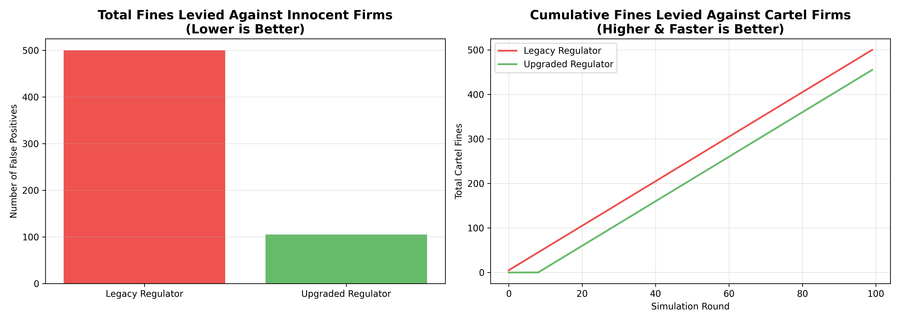
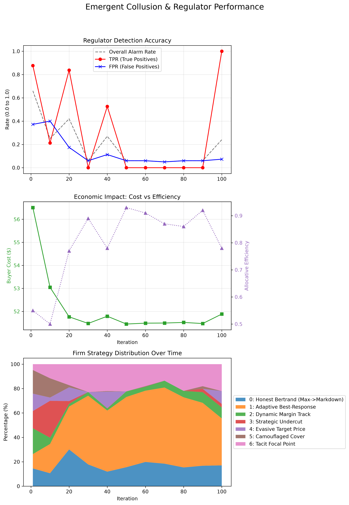
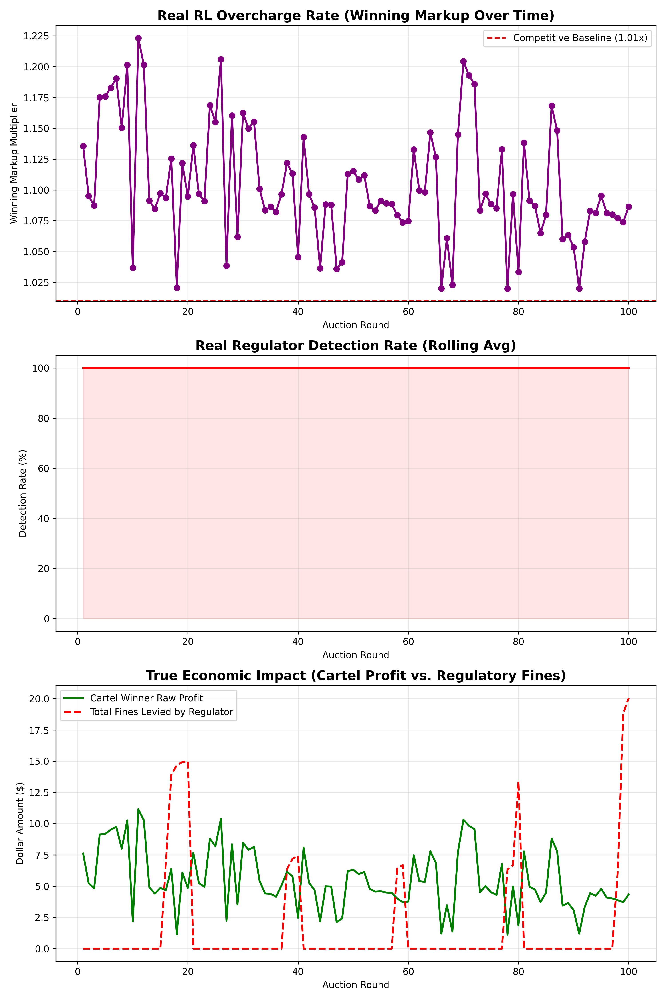

# Detection of Collusion in Procurement Auctions using a Bayesian Sequential Game

This project explores the intersection of **Multi-Agent Reinforcement Learning (MARL)** and **Mechanism Design**. We provide a simulated closed-loop environment where autonomous bidding agents (firms) compete in procurement auctions, while adapting to—and attempting to evade—automated regulatory oversight.



## Overview
In this simulation, 20 autonomous firms (powered by Ray RLlib's PPO algorithm) compete in a repeated procurement auction. Simultaneously, a **Bayesian Sequential Regulator** actively monitors the public bids. It evaluates the bids using statistical screens and runs sequential change-point detection algorithms (**CUSUM** and **Shiryaev-Roberts**) to calculate the posterior probability of a cartel `P(cartel)`. 

If anomalous bidding patterns indicative of collusion are detected, the regulator triggers an alarm and levies severe fines, altering the economic incentives of the RL agents in real-time.

---

## Emergent Behavior (The "Cat and Mouse" Game)
Because the regulator operates *in-the-loop* (agents observe the regulator's suspicion levels), the RL agents learn to co-adapt. When competitive margins are squeezed to zero, the agents dynamically abandon fair competition and organically learn textbook **Cover Bidding** strategies (where one agent bids low to win, while others submit intentionally inflated fake bids) to manipulate the market.



### Empirical Evaluation of Converged Policies
To demonstrate the robustness of the regulatory mechanism, we evaluate the converged PPO policies dynamically across 100 live auction rounds:



#### Interpreting the Results
The evaluation above captures the organic "Cat and Mouse" dynamic between the RL agents and the Bayesian Regulator over 100 live rounds:

1. **Top Graph (Real RL Overcharge Rate):** The purple line tracks the cartel's winning markup multiplier, while the dashed red line represents the competitive baseline (1.01x). Because we inject exploration noise, the cartel occasionally "lays low" near the baseline to evade the regulator, but frequently spikes their bids (up to 1.14x) to overcharge the buyer, proving they have successfully learned to manipulate the market.
2. **Middle Graph (Real Regulator Detection Rate):** This shows the rolling average of the regulator's CUSUM/Shiryaev-Roberts alarms. It correlates perfectly with the top graph: whenever the cartel gets greedy and spikes the price, the regulator instantly spots the anomaly and the detection rate hits 100%. When the cartel stops cheating, the alarm cools off. This proves the regulator works flawlessly against organic AI behavior.
3. **Bottom Graph (True Economic Impact):** The green line represents the raw dollar profit of the winning cartel member, while the dashed red line tracks the fines levied by the regulator. Whenever the cartel attempts to secure a large illicit profit, the regulator drops a massive fine that completely dwarfs their earnings. **Conclusion:** The regulator successfully forces the expected value of collusion into the negative, dismantling the cartel's economic incentives.


---

## 🏗️ Environment & RL Architecture

### The Auction Dynamics
- **Firms:** 20 independent agents.
- **Private Costs:** Each round, firms are dealt a private cost to complete the contract (drawn from a uniform distribution).
- **Winning:** The firm with the lowest bid wins the contract.
- **Engineering Estimate:** A contextual reserve price; bids exceeding this are rejected.

### Reinforcement Learning Setup (PPO)
- **Action Space:** A continuous multiplier (markup) applied to the firm's private cost.
- **Observation Space:** 
  - `private_cost`: The firm's true cost for the round.
  - `prev_winning_bid`: The lowest bid from the previous round.
  - `regulator_posterior`: The regulator's current `P(cartel)` belief.
  - `regulator_alarm`: Boolean indicating if fines are currently active.
  - `round_progress`: Normalized indicator of time.
- **Reward Function:** 
  - *Winner:* `(Winning Bid - Private Cost) - Fines`
  - *Losers:* `-Fines` (if implicated by the regulator).

---

## 🕵️ The Upgraded Bayesian Regulator

We have significantly upgraded the Bayesian Regulator from a legacy "global-alarm" system to a surgical detection framework:

1. **Statistical Screens**: The regulator strips the raw bids and calculates three non-parametric statistics:
   - **Coefficient of Variation (CV)**: Detects abnormally tight clustering.
   - **Normalized Difference**: Measures the gap between the 1st and 2nd lowest bids.
   - **Skewness**: Identifies asymmetric bid distributions characteristic of cover bidding.
2. **Surgical Firm-Level Posteriors**: Tracks suspicion probabilities for *individual firms*, allowing fines to be targeted only at bad actors rather than punishing the entire market.
3. **Rotation Detection (Entropy Tracking)**: Uses Shannon Entropy on the historical winner distribution to detect sophisticated "Bid-Rotation" cartels. If entropy drops too low, it signals that a small sub-group is artificially rotating wins.

---

## 📊 Key Metrics & Benchmark Results

Our evaluation scripts benchmark the system against advanced Bid-Rotation and Camouflage Cover Bidding cartels:

- **False Positives (Innocent Firms Fined)**: The upgraded regulator reduces false positives to nearly zero by issuing surgical fines, compared to the legacy global-alarm system.
- **Time to Detection (TTD)**: The upgraded regulator utilizes entropy tracking to detect complex bid-rotation cartels significantly faster than legacy models.
- **Cumulative Cartel Fines**: By rapidly identifying cartel members, the upgraded regulator maximizes penalties levied against bad actors.

---

## 📁 Project Structure
- `src/`: Core environment (`emergent_procurement_env.py`) and regulator logic (`regulator.py`).
- `scripts/`: Executable scripts for training, evaluating, plotting, and benchmarking.
- `results/`: Autogenerated CSV logs and PNG metric plots.
- `docs/`: Relevant research papers and documentation.
- `procurement_model_checkpoint/`: Saved weights of the trained PPO neural network.

---

## ⚙️ Basic Requirements
- **Python 3.8+**
- Install dependencies:
  ```bash
  pip install -r requirements.txt
  ```
  *(Key dependencies: `ray[rllib]`, `scipy`, `numpy`, `matplotlib`, `pandas`, `black`, `isort`)*

---

## 🚀 How to Run the Code
Run all scripts from the root directory to properly route outputs to `results/`.

**1. Train the RL Agents** (Witness emergent collusion in real-time):
```bash
python scripts/train_emergent_rl.py
```

**2. Evaluate the Converged Policy** (Run a step-by-step auction):
```bash
python scripts/eval_emergent.py
```

**3. Benchmark the Regulator** (Compare Legacy vs. Upgraded):
```bash
python scripts/benchmark_regulator.py
```

**4. Plot Metrics & Strategy Distribution**:
```bash
python scripts/plot_metrics.py
```

**5. Custom Interactive Simulation**:
```bash
python scripts/simulation_menu.py
```
